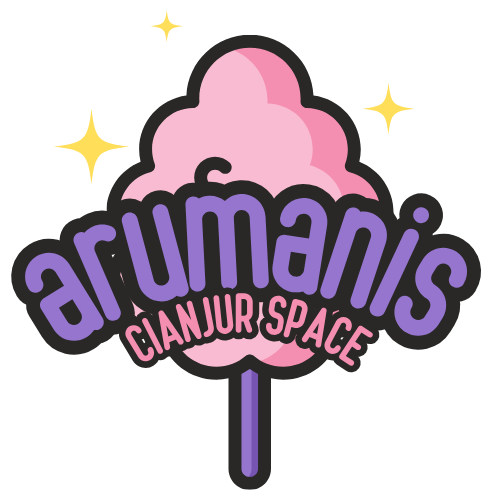

<div align="center">



# Arumanis Pengawasan

### Panel pengawas lapangan · subpath `/pengawasan`

Aplikasi ringan untuk pengawas: pantau paket yang ditugaskan, unggah foto + GPS, catat progress, kelola tiket. Berpasangan dengan [**APIAMIS**](https://github.com/ilhamtaufiq/apiamis) dan portal [**Arumanis**](https://github.com/ilhamtaufiq/arumanis).

[](package.json)
[](https://bun.sh/)
[](#deployment)
[](LICENSE)

<p>
  <a href="https://arumanis.cianjur.space/pengawasan"><strong>Production</strong></a>
  ·
  <a href="USER_GUIDE.md"><strong>User guide (web)</strong></a>
  ·
  <a href="apps/mobile/README.md"><strong>Mobile app</strong></a>
</p>

| Branch | Base path | Backend | Repo |
|:------:|:---------:|:-------:|:----:|
| `main` | `/pengawasan` | [apiamis](https://github.com/ilhamtaufiq/apiamis) | [arumanis-pengawasan](https://github.com/ilhamtaufiq/arumanis-pengawasan) |

</div>

---

## Peran di ekosistem

Ini **bukan** portal admin penuh. Hanya pekerjaan yang ditugaskan ke akun pengawas (aturan assignment di APIAMIS).

```text
  Portal Arumanis ──SSO / deep-link──►  /pengawasan  (repo ini)
                                              │
                     httpOnly cookie + BFF    │
                                              ▼
                                         APIAMIS (Laravel)
```

| Tanggung jawab | Web panel ini | APIAMIS |
|----------------|:-------------:|:-------:|
| UI dashboard pengawas | ya | — |
| Auth proxy & cookie | BFF | token & validasi |
| Business rules / RBAC | — | ya |
| Persistensi data | — | ya |

---

## Fitur

| Area | Isi |
|------|-----|
| **Dashboard** | KPI lokasi, pagu, ringkasan paket yang diawasi |
| **Pekerjaan** | Daftar + detail (info, progress, foto, output, penerima) |
| **Foto lapangan** | EXIF/GPS, geo-fence via backend, slot progress |
| **Tiket** | Dukungan teknis per pekerjaan |
| **Auth** | Login APIAMIS, SSO dari Arumanis, impersonasi (banner) |
| **Mobile** | Expo di `apps/mobile` (Bearer + SecureStore, offline, OTA) |

Stack: Bun · Hono BFF · React 18 · Vite 5 · React Router 6 · TanStack Query · Leaflet · workspaces (`packages/*`, `apps/*`).

---

## Mulai lokal

**Butuh:** Bun 1.2+ · APIAMIS hidup · Git

```text
C:\laragon\www\
  pengawas\   ← repo ini
  apiamis\
  bun\        ← portal admin Arumanis
```

```bash
git clone https://github.com/ilhamtaufiq/arumanis-pengawasan.git
cd arumanis-pengawasan
bun install
cp .env.example .env
# set APIAMIS_BASE_URL

bun run dev
```

Dev default: **http://localhost:3000**

```bash
bun run dev:client   # Vite :3000
bun run dev:server   # BFF watch
```

---

## Konfigurasi

```env
BUN_ENV=development
PORT=3000
APP_URL=http://localhost:3000

APIAMIS_BASE_URL=http://apiamis.test/api
API_TIMEOUT_MS=15000

SESSION_COOKIE_NAME=pengawas_session
SESSION_COOKIE_SECURE=false
```

### Production

| Variabel | Contoh | Catatan |
|----------|--------|---------|
| `APIAMIS_BASE_URL` | `https://apiamis.cianjur.space/api` | REST backend |
| `APP_PUBLIC_BASE_PATH` | `/pengawasan` | Subpath di reverse proxy |
| `SESSION_COOKIE_PATH` | `/pengawasan` | Samakan dengan base path |
| `SESSION_COOKIE_SECURE` | `true` | Wajib HTTPS |
| `VITE_REVERB_*` | host/port/scheme | Realtime (opsional) |

Jangan hardcode URL API di source; pakai env.

---

## Struktur

```text
server/index.ts          Hono BFF — auth, proxy, static
src/
  pages/                 Dashboard, Pekerjaan, Tiket, …
  components/
  lib/api.ts             Client ke BFF (bukan langsung APIAMIS)
  hooks/
apps/mobile/             Expo native (Android/iOS)
packages/                shared + api-client (workspaces)
scripts/dev.ts
tests/
```

- API browser → `src/lib/api.ts` → `/bff/*` → APIAMIS  
- Token tidak di `localStorage` (web); mobile: SecureStore  

---

## Skrip

| Perintah | Fungsi |
|----------|--------|
| `bun run dev` | Vite + BFF |
| `bun run build` / `start` | Build & serve production |
| `bun run typecheck` | TypeScript |
| `bun test` | Unit test Bun |
| `bun run mobile` | Expo dev |
| `bun run mobile:web` | Mobile di browser |
| `bun run mobile:build-android` | APK (Gradle / VPS) |

---

## Mobile (Expo)

Auth langsung ke APIAMIS (tanpa BFF web). Offline cache ~24 jam, GPS presence, foto antri, OTA JS.

```bash
bun install
cp apps/mobile/.env.example apps/mobile/.env
# EXPO_PUBLIC_APIAMIS_BASE_URL = IP LAN untuk device fisik
bun run mobile
```

Panduan lapangan lengkap: **[apps/mobile/README.md](apps/mobile/README.md)**.

---

## Deploy

```bash
docker build -t arumanis-pengawasan .
docker run -d -p 3000:3000 arumanis-pengawasan
```

Mount di reverse proxy (Nginx / Caddy / Coolify) path **`/pengawasan`**.

```text
GET /pengawasan/health
```

```json
{
  "ok": true,
  "env": "production",
  "apiBase": "https://apiamis.cianjur.space/api"
}
```

Portal Arumanis mengarahkan ke panel lewat `VITE_PENGAWAS_APP_BASE_URL=/pengawasan`. SSO token lewat callback URL didukung.

---

## Docs pengguna

| Dokumen | Isi |
|---------|-----|
| [USER_GUIDE.md](USER_GUIDE.md) | Panel web |
| [TUTORIAL-PANDUAN.md](TUTORIAL-PANDUAN.md) | Tutorial visual web |
| [apps/mobile/README.md](apps/mobile/README.md) | App lapangan |

---

## Platform (tiga repo)

| Repo | Peran |
|------|--------|
| [arumanis-pengawasan](https://github.com/ilhamtaufiq/arumanis-pengawasan) | Panel ini + mobile |
| [apiamis](https://github.com/ilhamtaufiq/apiamis) | Laravel REST |
| [arumanis](https://github.com/ilhamtaufiq/arumanis) | Portal admin / operasional |

Ubah kontrak assignment / endpoint pengawas di **APIAMIS dulu**, baru sesuaikan panel ini.

---

## Lisensi

MIT (lihat [LICENSE](LICENSE) bila ada di repo).

<div align="center">

<br />


<sub>Pengawasan lapangan · Air Minum &amp; Sanitasi Cianjur</sub>

</div>
